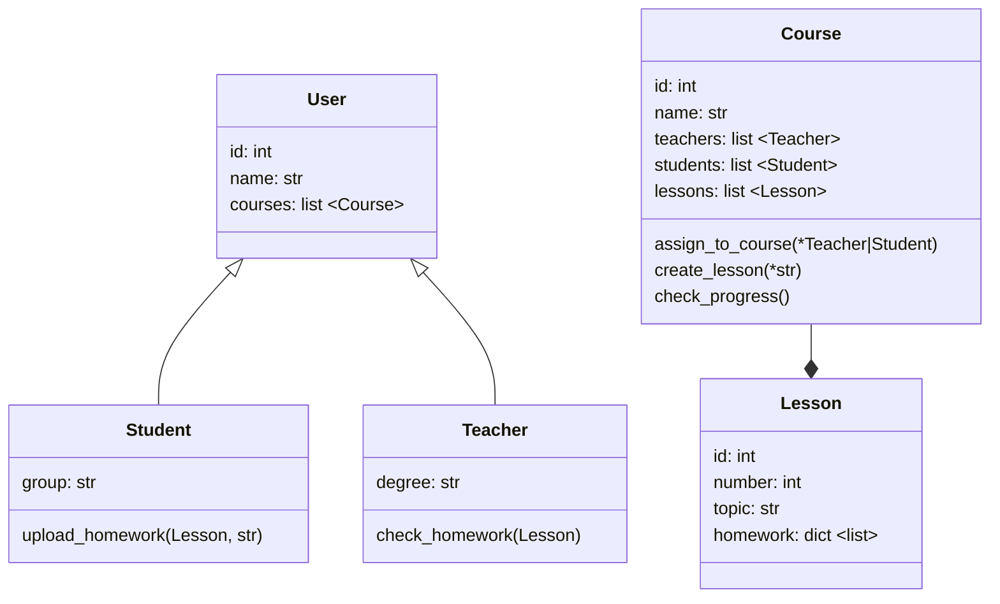

# Задачи курса Codemika: Python-разработчик
Пунина Полина Викторовна

## Задача 25-1

### Задание

Продукт предусматривает возможность:
- создавать пользователей системы,
- создавать курсы, на которые пользователи будут зачисляться,
- производить зачисление на курс
- выставлять по курсу итоговую оценку для каждого учащегося.

Вам необходимо:

1. Продумать UML-диаграмму для вашего mvp LMS.
2. Реализовать все необходимые сущности (поля и методы можно вводить самые необходимые для работы системы).
3. Показать пример создания пользователя, создания курса, зачисление на  курс пользователя и проставление итоговой оценки пользователю по курсу.

### UML-диаграмма



### Решение

[25-1.py](./25-1.py)

## Задача 33-1

### Задание

Создайте собственного чат-бота, который:
1. Здоровается с пользователем при вызове команды start
2. Придумывает случайное число и просит вас его угадать, давай подсказки (задуманное число больше или меньше).
В случае, если пользователь угадал число, программа его хвалит. Если не угадал с n попытки (сами задаете n), пользователю сообщается, что он проиграл.

Структура бота должна быть такой:
- файл config c кодом:
```python
import os
telegram_token = os.environ['telegramToken']
```
- файл main или __init__.py с кодом бота, который вы отправляете на проверку.

Задача проверяется преподавателем в ручном режиме.

### Решение

- Бот 1: [main.py](./33-1-kotobotok/main.py), [config.py](./33-1-kotobotok/config.py);
- Бот 2: [main.py](./33-1-game_of_numbers_bot/main.py), [config.py](./33-1-game_of_numbers_bot/config.py).
