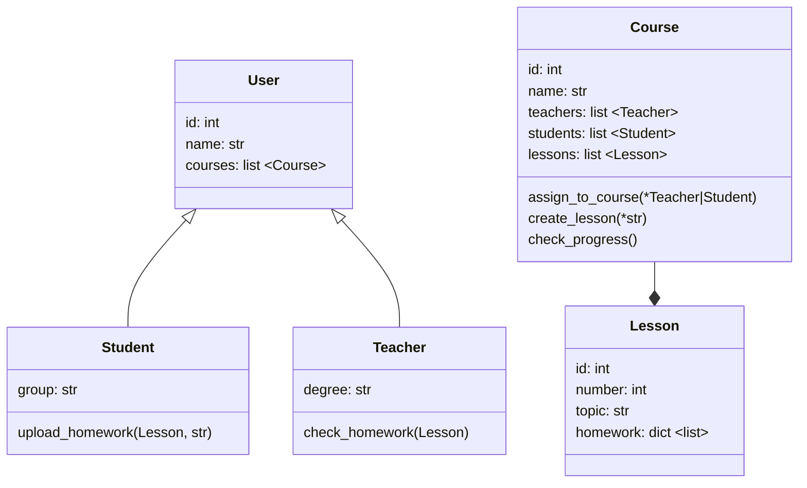

# Задачи курса Codemika: Python-разработчик
Пунина Полина Викторовна

## Задача 25-1

Продукт предусматривает возможность:
- создавать пользователей системы,
- создавать курсы, на которые пользователи будут зачисляться,
- производить зачисление на курс
- выставлять по курсу итоговую оценку для каждого учащегося.

Вам необходимо:

1. Продумать UML-диаграмму для вашего mvp LMS.
2. Реализовать все необходимые сущности (поля и методы можно вводить самые необходимые для работы системы).
3. Показать пример создания пользователя, создания курса, зачисление на  курс пользователя и проставление итоговой оценки пользователю по курсу.

### UML-диаграмма

